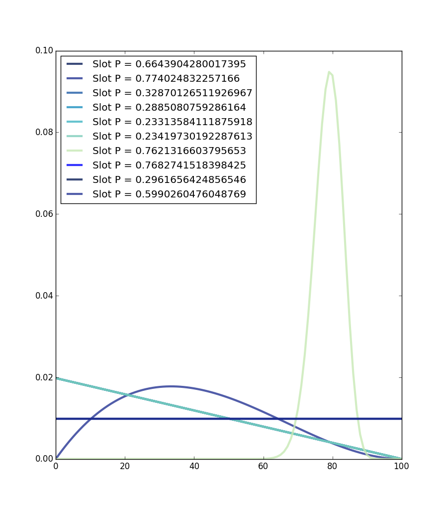

# Progress Report 3
Evan Dorsky

### 1. Reading

I've done all the required readings in NB as well as the multi-armed bandit suggested reading. There was a lot of math in chapter 10, and I don't think I've absorbed it all yet, but the idea of estimation for sake of faster computation makes a lot of sense. I enjoyed reading about the multi-armed bandit problem, especially the part about applications. This seems like a very widely applicable process to follow when learning about a new environment.

### 2. Exercises

Ben and I decided to reimplement the `pymc` code presented in the bandit reading with ThinkBayes2.

Below is our code:

	import thinkbayes2 as tb
	import thinkplot as tp
	from random import random
	 
	class Bandit(tb.Suite):

	    def __init__(self, label=None):
	        self.p = random() # random prob of success
	        pmf = tb.MakePmfFromList(list(range(101)))
	        tb.Suite.__init__(self, pmf, label=label)

	    def setlabel(self, label):
	        self.label = label

	    def Likelihood(self, data, hypo):
	        if data == 1:
	            like = hypo/100.0
	        else:
	            like = 1-hypo/100.0

	        return like 

	    def pull(self):
	        return random() < self.p

	def main():
	    bandits = [Bandit(label='Slot ' + str(i)) for i in range(10)]
	    for b in bandits:
	        b.label = 'Slot P = ' + str(b.p)
	    # uniform prior
	    i = 0
	    while i < 100:
	        means = [b.Mean() for b in bandits]
	        bestbandit = bandits[ means.index(max(means)) ]
	        bestbandit.Update(bestbandit.pull())
	        i += 1
	    tp.Pdfs(bandits)
	    tp.Show()

	if __name__ == '__main__':
	    main()

A bandit is a suite that represents our belief in its probability of paying out. We update a bandit with the data from a pull (which simply reports a win or loss based on the method in the reading).

We represented the data as a list of bandit suites. Here, we do 100 tries, always choosing the bandit with the highest mean belief of success. So if a bandit pays out, we'll keep pulling it until it fails enough to decrease its mean to below the next highest one.

As the graph below shows, there's a chance that this method will return a local minimum, and in general we only gain confidence in the payout probability of a single bandit: the one we think is the best.

In this plot, we end up sticking to the bandit with a payout probability of 76%, which is the third best. The random sampling nature makes it hard to differentiate between the three top bandits, which are all within less than 1% of each other.

### 3. Case study proposal

My case study idea (based on Oscar's suggestion) is to wrap parts of ThinkBayes2 in a Flask webserver and build an interactive web frontend for the library. I already have a proof of concept that generates and returns a PMF on the backend in response to a request from the frontend.

The idea is that the frontend would hold all the state, and the backend would do all the math. I'll probably start small, with something like a graph of a PMF that allows you to update the distribution by clicking on datapoints. For the frontend interaction I'd use d3.js, a library I'm somewhat familiar with.

### 4. Reflection

I was pretty happy with the example that Ben and I did. It convinced me that I had a working understanding of the ThinkBayes2 library and some of the concepts we've gone over in class. I'm not totally sure whether I'll pursue this case study or a Spades-related one with Emily and Cameron. I'm a little worried that this case study might have me focusing too much on web development and data transfer over Bayesian concepts, but I think I'll do a proof of concept this week, and if it looks like I'm going to get bogged down in the implementation, I'll have time to switch to Spades -- I've been doing some thinking about what that would look like.